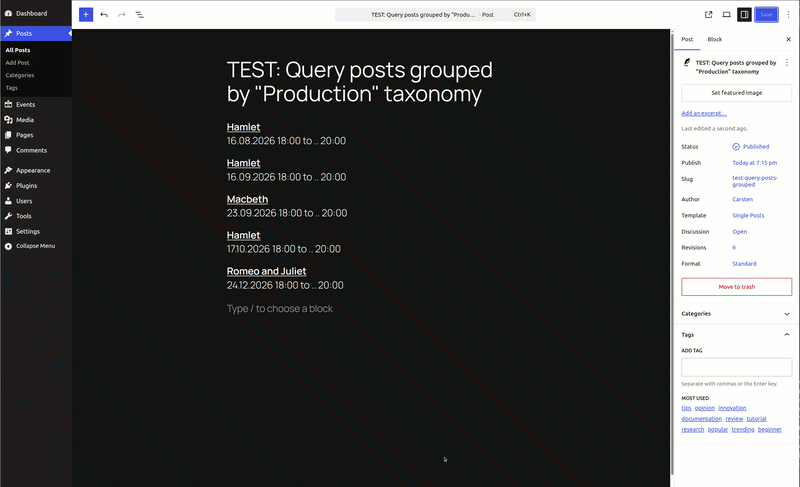

# Query Posts Grouped by Taxonomy

**Contributors:**      carstenbach  
**Tags:**              query, block, taxonomy, groupby, posts, extension  
**Tested up to:**      6.8  
**Stable tag:**        0.1.0  
**License:**           GPLv2 or later  
**License URI:**       https://www.gnu.org/licenses/gpl-2.0.html  

 

Extends the core Query Loop block with a "Group by Taxonomy" option, enabling grouped front-end output by any selected taxonomy.

## Description

This plugin adds a **Group by Taxonomy** Inspector panel to the core Query Loop block. When a taxonomy is selected, the query results are modified server-side via `posts_clauses` to join taxonomy tables and order by term name — enabling grouped output on the front end.

**Motivation:**

*We needed a way to query upcoming events, unique by theater-productions. [Try this plugin together with GatherPress](https://playground.wordpress.net/?blueprint-url=https://raw.githubusercontent.com/carstingaxion/query-groupedby-taxonomy/main/.wordpress-org/blueprints/blueprint-with-gatherpress.json) to see, what we wanted to achieve.*

**Features:**

* Adds a "Group by Taxonomy" panel to the core Query Loop block Inspector.
* Supports any public taxonomy associated with the selected post type.
* Uses `pre_render_block` and `query_loop_block_query_vars` to inject custom query variables.
* Modifies the SQL via `posts_clauses` for efficient taxonomy-based ordering and grouping.
* No additional blocks required — works directly with the existing Query Loop.
* Clean, BEM-compliant editor styles.
* Fully compliant with WordPress and WordPress VIP coding standards.

## Installation

1. Upload the plugin files to the `/wp-content/plugins/query-groupedby-taxonomy` directory.
2. Activate the plugin through the 'Plugins' screen in WordPress.
3. In the block editor, insert a Query Loop block and open the "Group by Taxonomy" panel in the Inspector sidebar.
4. Select a taxonomy to enable grouping on the front end.

## Frequently Asked Questions

### Does this replace the Query Loop's output?

The SQL query is modified to join taxonomy tables and order by term name. The actual rendering depends on the Query Loop's inner blocks and any additional front-end processing.

### Can I use custom taxonomies?

Yes. Any publicly registered taxonomy associated with the selected post type will appear in the taxonomy selector.

## Changelog

### 0.1.0

* Initial release.
